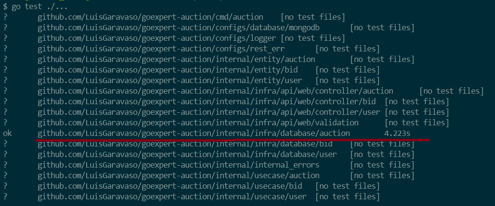
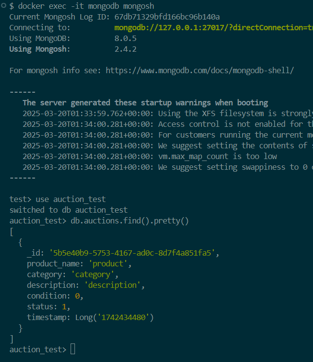

# 📦 Laboratório 03 - Fechamento Automático de Leilão (Go Expert)

Este desafio tem como objetivo adicionar uma **nova funcionalidade de encerramento automático dos leilões** com base em um tempo determinado via variável de ambiente.

## 📋 Descrição

O projeto original já conta com toda a lógica de criação de leilões e lances (bids), no entanto, é necessário melhorar a aplicação adicionando **uma rotina assíncrona de encerramento automático do leilão**, utilizando **Goroutines** e implementar o teste para validar se o fechamento está acontecendo de forma automatizada.

### ✅ Funcionalidades implementadas:

- [x] Cálculo da duração do leilão baseado em variáveis de ambiente;
- [x] Goroutine que verifica periodicamente se há leilões com tempo expirado;
- [x] Atualização automática do status do leilão ao expirar;
- [x] Teste automatizado validando o encerramento automático do leilão.

## 🚀 Como usar o projeto

### 📦 Pré-requisitos

- [Go](https://golang.org/doc/install) instalado na máquina
- [Docker](https://www.docker.com/) instalado e em execução

### 🔧 Passo a passo

1. **Clone o repositório**
   ```bash
   git clone https://github.com/LuisGaravaso/goexpert-auction.git
   cd goexpert-auction
   ```

2. **Suba o MongoDB com Docker**
   ```bash
   docker run -d --name mongodb -p 27017:27017 mongo
   ```

3. **Execute o teste**
   
   A função de fechamento do leilão foi implementada em `internal/infra/database/auction/create_auction.go`
   O teste foi implementado em `internal/infra/database/auction/create_auction_test.go`

   ```bash
   go test ./...
   ```

    Você verá:
    


4. **(Opcional) Visualize os dados gravados no MongoDB**
   ```bash
   docker exec -it mongodb mongosh
   ```

   Dentro do terminal interativo do Mongo:
   ```js
   use auction_test;
   db.auctions.find().pretty();
   ```

    Você verá um resultado com o Leilão com Status == 1, que indica o fechamento:
    

---

## 📁 Folder Structure

```
goexpert-auction/
├── cmd/
│   └── auction/                 # Ponto de entrada da aplicação
├── configs/                    # Configurações gerais
├── internal/
│   ├── entity/                 # Entidades de domínio
│   │   ├── auction/            # Entidade Auction (leilão)
│   │   ├── bid/                # Entidade Bid (lance)
│   │   └── user/               # Entidade User (usuário)
│   ├── infra/                  # Infraestrutura do projeto
│   │   ├── api/                # Camada de entrega (HTTP handlers)
│   │   └── database/           # Implementações de persistência
│   │       ├── auction/        # Repositório do leilão
│   │       ├── bid/            # Repositório de lances
│   │       └── user/           # Repositório de usuários
│   ├── internal_errors/        # Definição de erros customizados
│   └── usecase/                # Casos de uso (lógica de negócio)
│       ├── auction/            # Casos de uso para leilão
│       ├── bid/                # Casos de uso para lances
│       └── user/               # Casos de uso para usuários
```